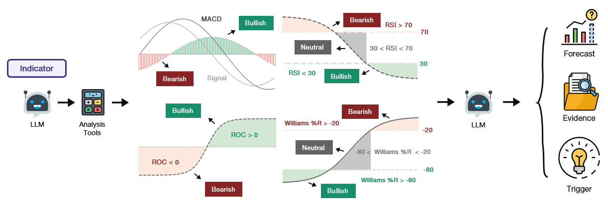
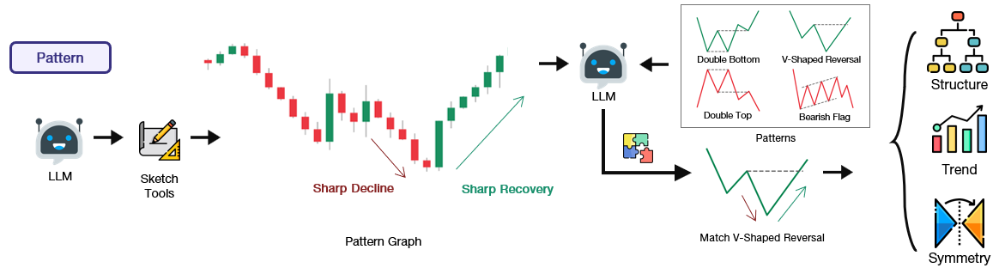
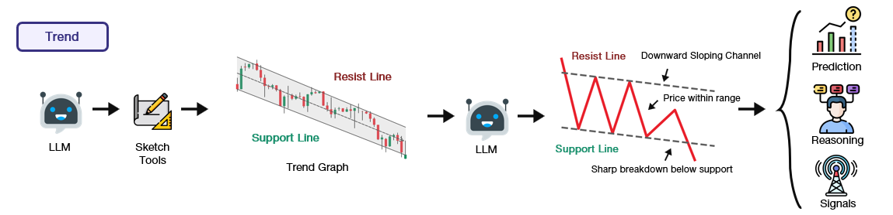
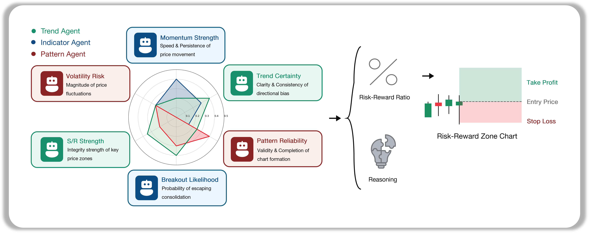
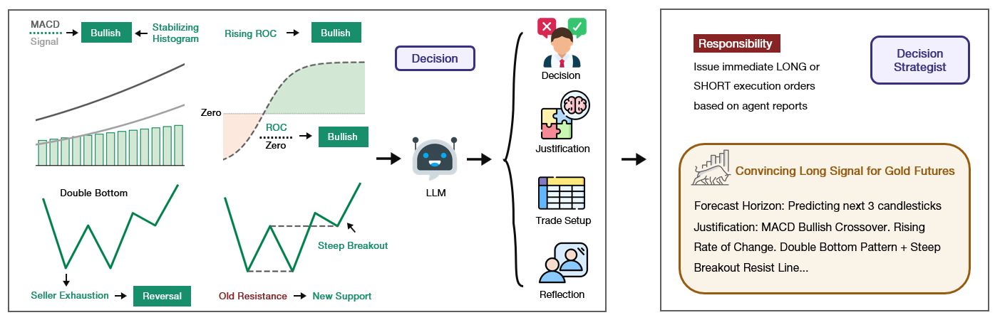

# QuantAgents

A sophisticated multi-agent trading analysis system that combines technical indicators, pattern recognition, and trend analysis using LangChain and LangGraph. The system provides both a web interface and programmatic access for comprehensive market analysis.


> QuantAgent is a research-oriented tool designed to explore algorithmic decision-making in financial contexts. Its performance depends on a wide range of variables, including the selected language model, parameter tuning, data integrity, market volatility, and other stochastic elements. Outcomes generated by QuantAgent are inherently experimental and should not be interpreted as recommendations for actual trading or investment activities.

## 🚀 Features

- **Multi-Agent Analysis**: Four specialized agents working together:
  
  - **Indicator Agent**: Computes technical indicators (MACD, RSI, Stochastic, etc.)
  
  - **Pattern Agent**: Identifies candlestick patterns and generates visual charts
  
  - **Trend Agent**: Analyzes market trends and generates trend visualizations
  
  - **Risk Agent**: Aggregates the Indicator, Pattern, and Trend reports to quantify potential drawdowns, recommend position sizing, and define stop‑loss thresholds for comprehensive risk management.
  
  - **Decision Agent**: Integrates the Indicator, Pattern, Trend, and Risk reports to issue final trade directives—specifying LONG/SHORT signals and justification.
  

- **Web Interface**: Modern Flask-based web application with:
  - Real-time market data from Yahoo Finance
  - Interactive asset selection (stocks, crypto, commodities, indices)
  - Multiple timeframe analysis (1m to 1d)
  - Dynamic chart generation
  - API key management


## 🔧 Implementation Details

We built QuantAgents with LangGraph to ensure flexibility and modularity. We utilize gpt-4o and gpt-4o-mini as our deep thinking and fast thinking LLMs for our experiments. However, for testing purposes, we recommend you use gpt-4o-mini to save on costs as our framework makes lots of API calls.

**Important Note**: Our model requires an LLM that can take images as input, as our agents generate and analyze visual charts for pattern recognition and trend analysis.

### Python Usage

To use QuantAgents inside your code, you can import the trading_graph module and initialize a TradingGraph() object. The .invoke() function will return a comprehensive analysis. You can run web_interface.py, here's also a quick example:

```python
from trading_graph import TradingGraph

# Initialize the trading graph
trading_graph = TradingGraph()

# Create initial state with your data
initial_state = {
    "kline_data": your_dataframe_dict,
    "analysis_results": None,
    "messages": [],
    "time_frame": "4hour",
    "stock_name": "BTC"
}

# Run the analysis
final_state = trading_graph.graph.invoke(initial_state)

# Access results
print(final_state.get("final_trade_decision"))
print(final_state.get("indicator_report"))
print(final_state.get("pattern_report"))
print(final_state.get("trend_report"))
```

You can also adjust the default configuration to set your own choice of LLMs, analysis parameters, etc.

```python
from trading_graph import TradingGraph
from default_config import DEFAULT_CONFIG

# Create a custom config
config = DEFAULT_CONFIG.copy()
config["agent_llm_model"] = "gpt-4o-mini"  # Use a different model for agents
config["graph_llm_model"] = "gpt-4o"       # Use a different model for graph logic
config["agent_llm_temperature"] = 0.2      # Adjust creativity level for agents
config["graph_llm_temperature"] = 0.1      # Adjust creativity level for graph logic

# Initialize with custom config
trading_graph = TradingGraph(config=config)

# Run analysis with custom configuration
final_state = trading_graph.graph.invoke(initial_state)
```

For live data, we recommend using the web interface as it provides access to real-time market data through yfinance. The system automatically fetches the most recent 30 candlesticks for optimal LLM analysis accuracy.

### Configuration Options

The system supports the following configuration parameters:

- `agent_llm_model`: Model for individual agents (default: "gpt-4o-mini")
- `graph_llm_model`: Model for graph logic and decision making (default: "gpt-4o")
- `agent_llm_temperature`: Temperature for agent responses (default: 0.1)
- `graph_llm_temperature`: Temperature for graph logic (default: 0.1)

**Note**: The system uses default token limits for comprehensive analysis. No artificial token restrictions are applied.

You can view the full list of configurations in `default_config.py`.

## 📊 Benchmark

The `benchmark/` folder contains evaluation datasets for testing the QuantAgents system across multiple assets. For each asset, we collect 5000 historical bars via public trading APIs such as yfinance.

From this data, we randomly sample 100 evaluation segments per asset. Each segment is composed of a sequence of 100 consecutive candlesticks, and the final three candlesticks are withheld from the input to prevent exposing the verified market outcome within the test-time prompt. The system operates in a zero-shot setting—without any supervised fine-tuning—by generating structured trade reports that include a directional decision (LONG or SHORT), a concise textual justification, and a predicted risk-reward ratio.

### Available Assets
- **BTC**: Bitcoin (100 CSV files)
- **CL**: Crude Oil (100 CSV files)
- **DJI**: Dow Jones Industrial Average (100 CSV files)
- **ES**: E-mini S&P 500 (100 CSV files)
- **GC**: Gold Futures (100 CSV files)
- **NQ**: Nasdaq Futures (100 CSV files)
- **QQQ**: Invesco QQQ Trust (100 CSV files)
- **SPX**: S&P 500 (100 CSV files)

Each CSV file contains 4-hour candlestick data with OHLCV (Open, High, Low, Close, Volume) information for evaluation and backtesting purposes.

## 🛠️ Prerequisites

- Python 3.10 (highly recommended for compatibility)
- Conda (recommended) or pip
- OpenAI API key
- TA-Lib library

## 📦 Installation

### 1. Create and Activate Conda Environment

```bash
conda create -n quantagents python=3.10
conda activate quantagents
```


### 2. Install Dependencies

```bash
pip install -r requirements.txt
```


If you encounter issues with TA-lib-python, 
try

```bash
conda install -c conda-forge ta-lib
```

Or visit the [TA-Lib Python repository](https://github.com/ta-lib/ta-lib-python) for detailed installation instructions.

### 3. Set Up OpenAI API Key
You can set it in our Web InterFace Later,


Or set it as an environment variable:
```bash
export OPENAI_API_KEY="your_api_key_here"
```


## 🚀 Usage

### Start the Web Interface

```bash
python web_interface.py
```

The web application will be available at `http://127.0.0.1:5000`

### Web Interface Features

1. **Asset Selection**: Choose from available stocks, crypto, commodities, and indices
2. **Timeframe Selection**: Analyze data from 1-minute to daily intervals
3. **Date Range**: Select custom date ranges for analysis
4. **Real-time Analysis**: Get comprehensive technical analysis with visualizations
5. **API Key Management**: Update your OpenAI API key through the interface


## 📺 Demo


## 🤝 Contributing

1. Fork the repository
2. Create a feature branch
3. Make your changes
4. Add tests if applicable
5. Submit a pull request

## 📄 License

This project is licensed under the MIT License - see the LICENSE file for details.

## 🙏 Acknowledgements

This repository was built off of [**LangGraph**](https://github.com/langchain-ai/langgraph), [**OpenAI**](https://github.com/openai/openai-python), [**yfinance**](https://github.com/ranaroussi/yfinance), [**Flask**](https://github.com/pallets/flask), and [**TechnicalAnalysisAutomation**](https://github.com/neurotrader888/TechnicalAnalysisAutomation/tree/main).

## ⚠️ Disclaimer

This software is for educational and research purposes only. It is not intended to provide financial advice. Always do your own research and consider consulting with a financial advisor before making investment decisions.

## 🐛 Troubleshooting

### Common Issues

1. **TA-Lib Installation**: If you encounter TA-Lib installation issues, refer to the [official repository](https://github.com/ta-lib/ta-lib-python) for platform-specific instructions.

2. **OpenAI API Key**: Ensure your API key is properly set in the environment or through the web interface.

3. **Data Fetching**: The system uses Yahoo Finance for data. Some symbols might not be available or have limited historical data.

4. **Memory Issues**: For large datasets, consider reducing the analysis window or using a smaller timeframe.

### Support

If you encounter any issues, please:
1. Check the troubleshooting section above
2. Review the error messages in the console
3. Ensure all dependencies are properly installed
4. Verify your OpenAI API key is valid and has sufficient credits

## 📧 Contact

For questions, feedback, or collaboration opportunities, please contact:

**Email**: [chenyu.you@stonybrook.edu](mailto:chenyu.you@stonybrook.edu) 
